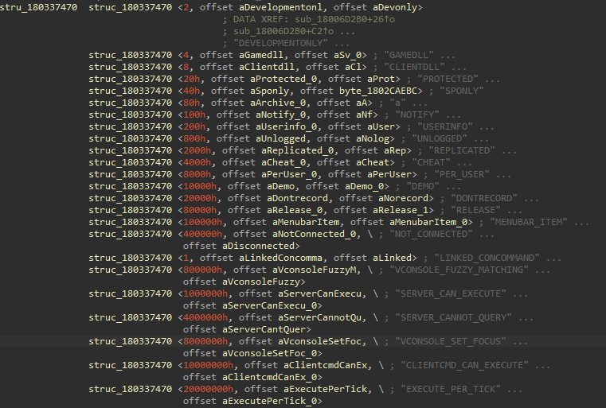
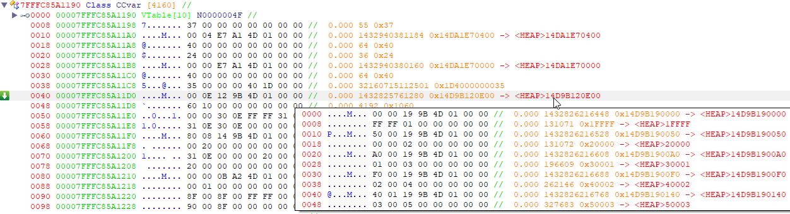
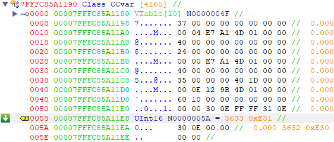
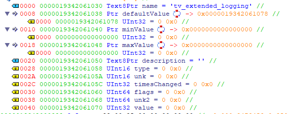
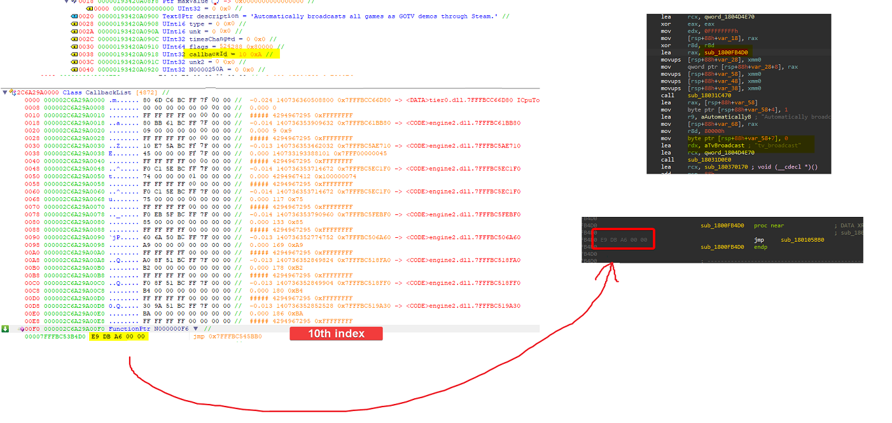

# ConVars

:::info
Flag definitons can be found in **tier0** by searching for xrefs to any of the flag names (e.g. `DEVELOPMENTONLY`)
:::

:::caution
Code that translates flags to a human readable format reads the structs from the middle, thus the flags are read by going backwards


:::

## List of ConVars

An array of pointers is located in the CCvar interface on offset 0x40



The size of the array is a 16bit number also located in the CCvar interface on offset 0x58



If we iterate through the array and dereference the pointers, we can get all the registered convars in the game.

## ConVar structure

Thanks to SlidyBat for the proper ConVar structure.

```cpp
class ConVar
{
public:
	const char *name; //0x0000
	ConVarValue_t *defaultValue; //0x0008
	ConVarValue_t *minValue; //0x0010
	ConVarValue_t *maxValue; //0x0018
	const char *description; //0x0020
	ConVarType_t type; //0x0028
	uint16_t unk1; //0x002A
	uint32_t timesChanged; //0x002C
	ConVarFlags_t flags; //0x0030
	uint32_t callbackId; //0x0038
	// Used when setting default, max, min values from the ConVarDesc_t
	// although that's not the only place of usage
	// flags seems to be:
	// (1 << 0) Skip setting value to split screen slots and also something keyvalues related
	// (1 << 1) Skip setting default value
	// (1 << 2) Skip setting min/max values
	uint32_t allocation_flag_of_some_sort; //0x003C
	ConVarValue_t values[]; //0x0040
}; //Size: 0x0044
```



In most cases there's only one value, but if the flag is `FCVAR_PER_USER` it will be equal to `g_pCVar->GetMaxSplitScreenSlots()`.

`callbackId` is the index of the callback that gets looked up in another linked list.

`type` indicates the type of the value.

```cpp
enum EConVarType : short
{
	EConVarType_Bool,
	EConVarType_Int16,
	EConVarType_UInt16,
	EConVarType_Int32,
	EConVarType_UInt32,
	EConVarType_Int64,
	EConVarType_UInt64,
	EConVarType_Float32,
	EConVarType_Float64,
	EConVarType_String,
	EConVarType_Color,
	EConVarType_Vector2,
	EConVarType_Vector3,
	EConVarType_Vector4,
	EConVarType_Qangle
};
```

[Source](https://github.com/alliedmodders/hl2sdk/pull/125/)

## ConVar callbacks

Rather than convars storing a pointer to their callback function, they store an ID that gets looked up in a list of callbacks.

CCvar+0x80 is a pointer to a list of ConVar callbacks. Every callback pointer will be `24 * callbackId` bytes away from the start of the list.

Every convar will store its callback ID in the `callbackId` field. See above.

