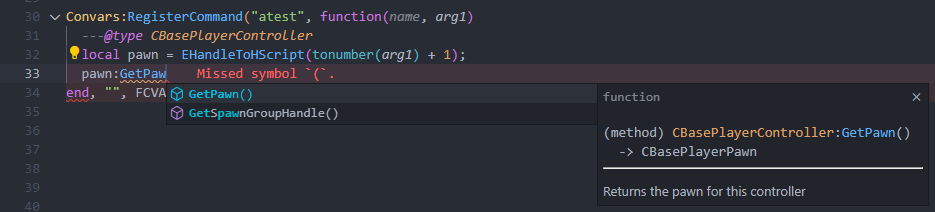
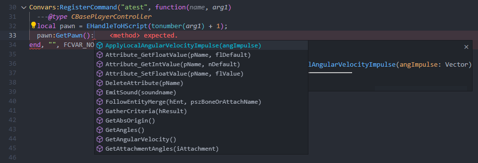

# VSCode Extension

:::caution WORK IN PROGRESS
This extension is still work in progress. While it should contain most of the functions/methods, it may still contain errors
:::

This extension adds CS2's VScript definitions to the [sumneko.lua extension](https://marketplace.visualstudio.com/items?itemName=sumneko.lua).




## Download

[Download from the VSCode Marketplace](https://marketplace.visualstudio.com/items?itemName=poggudev.cs2-vscript-natives)

## Casting from HScript

Because the extension doesn't know the type of a HScript instance (It can represent multiple types, CBaseEntity, CBasePlayerPawn, CBasePlayerController, etc..), it will always represent `handle/any`. This means that you will have to cast it to the correct type yourself.

```lua
---@type CBasePlayerController
local pawn = EntIndexToHScript(entIndex);
pawn:GetPawn();
```

Alternatively, you can make a wrapper function that will cast it to the correct type for you.

```lua
---@return CBasePlayerPawn
function EntIndexToPawn(entIndex)
    return EntIndexToHScript(entIndex)
end

---@return CBasePlayerController
function EntIndexToController(entIndex)
    return EntIndexToHScript(entIndex)
end

---@return CBaseEntity
function EntIndexToEntity(entIndex)
    return EntIndexToHScript(entIndex)
end
```
